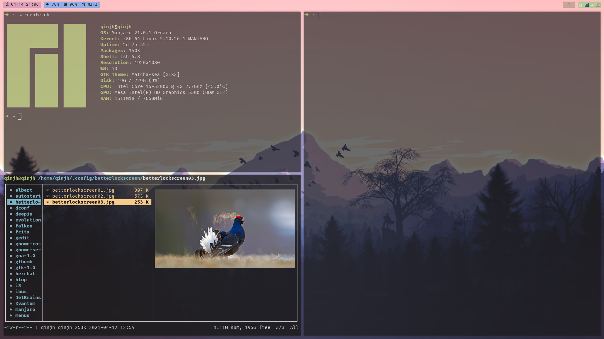

# dotfiles

## yadm

This repository contains the configuration files for the tools I use day-to-day.

I use a simple tool called [yadm](https://github.com/TheLocehiliosan/yadm) to manage my dotfiles, but it's not required, we can use other _dotfiles_ tools to reference [Awesome dotfiles](https://github.com/webpro/awesome-dotfiles).

- [Yadm Getting Started](https://yadm.io/docs/getting_started)
- [Yadm：我是如何同步并管理我的 Dotfiles 的？](https://blog.spencerwoo.com/2020/07/how-i-manage-my-dotfiles).
- Some great setups: [paulirish](https://github.com/paulirish/dotfiles), [mathiasbynens](https://github.com/mathiasbynens/dotfiles/), [alrra](https://github.com/alrra/dotfiles/), [paulmillr](https://github.com/paulmillr/dotfiles), [gf3](https://github.com/gf3/dotfiles).

## Desktop Managerment Configuration

### I3

i3-gaps, polybar, rofi, picom, variety, betterlockscreen ...

- [ayamir](https://github.com/ayamir/i3-dotfiles)
- [i3 User’s Guide](https://i3wm.org/docs/userguide.html)
- [千玄子的配置](https://zjuyk.gitlab.io/posts/i3wm-config/)
- [Archcraft Designer](https://github.com/adi1090x)
- [A execllent designer of rofi + polybar](https://github.com/Murzchnvok)
- [Vincintosh](https://github.com/Vincintosh/dots_sept2018)
- [BrodieRobertson](https://github.com/BrodieRobertson/dotfiles)
- [davidarrieta](https://github.com/davidarrieta/dotfiles)
- [geraldoahnert](https://github.com/geraldoahnert/wm4noobs)
- [rafamadriz](https://github.com/rafamadriz/dotfiles)




### LXDE

**Configuration File:** `~/.config/openbox/lxde-rc.xml`.

### Openbox

openbox, obconf, obmenu-generator, tint2

- `~/.config/openbox/rc.xml`
- `~/.config/openbox/menu.xml`

**Keymap:**

- `W-S-e` _openbox --reconfigure_
- `W-S-m` _obmenu-generator -s -c_

## Other WM
### Ayamir's configuration
- [bspwm](https://github.com/ayamir/bspwm-dotfiles)
- [dwm](https://github.com/ayamir/dwm-dotfiles)
- [other wm](https://github.com/ayamir/nord-and-light)

## Other Configuration

### Touchpad for Notebook

**Enable Touchpad to click** and **Scorll to natural**

```sh
sudo vim /etc/X11/xorg.conf.d/30-touchpad.conf
```

```sh
Section "InputClass"
  Identifier "libinput touchpad catchall"
  MatchIsTouchpad "on"
  MatchDevicePath "/dev/input/event*"
  Driver "libinput"
  Option "NaturalScrolling" "true"
  Option "Tapping" "on"
EndSection
```
